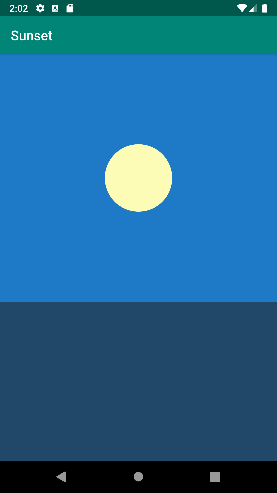
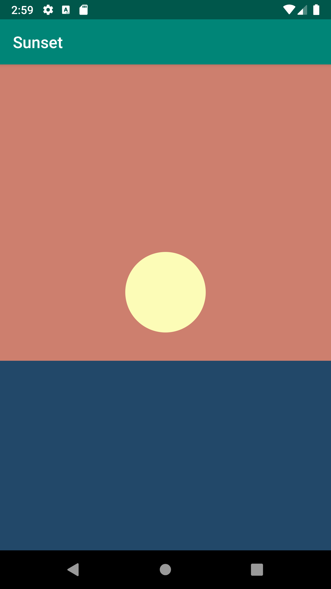

# Sunset

- An app that uses property animation to create a sunset over the water.

### Components

- Custom drawables
- Object Animation
- Kotlin Android Extensions
- TimeInterpolator

### Before Color Change Images

    

### After Color Change Images

    

    

    